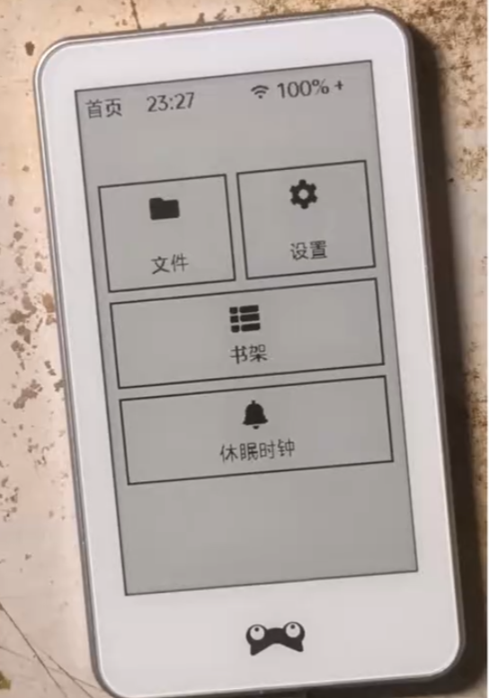
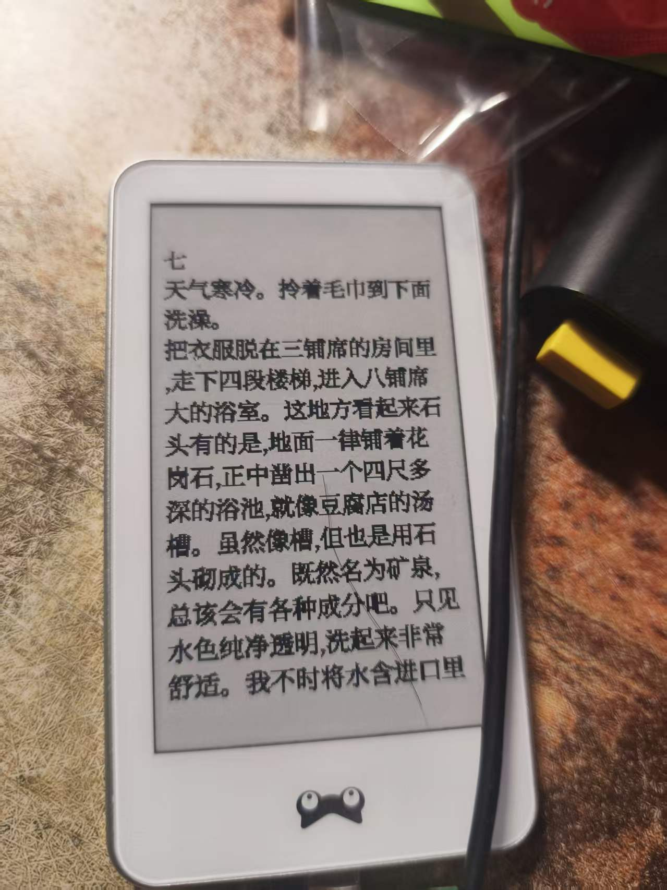
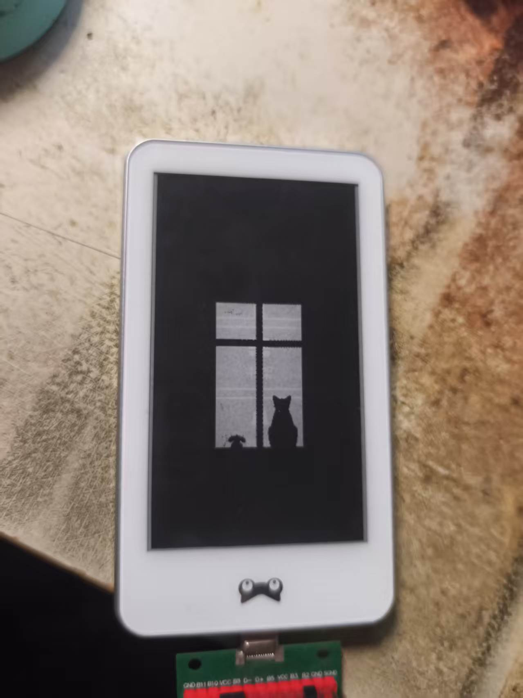
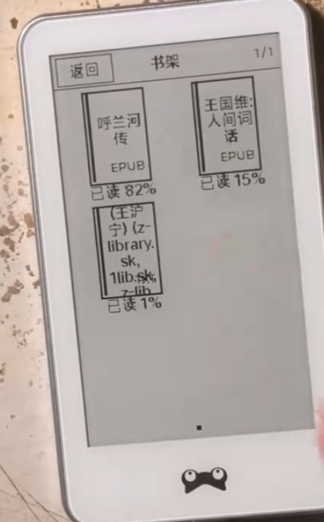

<h1 align="center">🖋️ Inkfrog FontExp</h1>

<p align="center">
  <strong>XR872 墨水屏开源阅读器固件</strong><br>
  3.7 寸 E-Ink · LVGL 图形库 · EPUB/TXT 阅读 · WiFi 传书 · 低功耗待机
</p>
<p align="center">
  
  
  
  
  
  
</p>


<p align="center">
  <a href="#-功能特性">功能</a> ·
  <a href="#-效果预览">预览</a> ·
  <a href="#-快速开始">快速开始</a> ·
  <a href="#-按键操作">按键</a> ·
  <a href="#-网页与工具">工具</a> ·
  <a href="#-编译">编译</a> ·
  <a href="#-硬件信息">硬件</a> ·
  <a href="#-仓库结构">结构</a> ·
  <a href="#-致谢">致谢</a>
</p>

---

## ✨ 功能特性

| 功能 | 说明 |
|:-----|:-----|
| 📚 **电子书阅读** | 支持 EPUB / TXT 格式，分页阅读、目录 TOC 锚点跳转、GBK 转码 |
| 🖼️ **墨水屏适配** | 3.7 寸 EPD（EPD_3IN52）驱动，LVGL 显示/输入移植，灰度局部刷新 |
| 🕐 **时钟待机** | 时钟界面、屏保、分钟级刷新，低功耗休眠 |
| 🔋 **充电模式** | 充电指示与充插拔状态机，拔插头不卡死 |
| 📚 **书架管理** | 文件管理 + 书架，多本书切换，进度保存 |
| ⚙️ **设置菜单** | 阅读、网络、显示等可配置项（设置接入方案） |
| 📡 **WiFi 传书** | HTTP 服务器网页传书，SNTP 授时，WiFi 首连加速 |
| 🔠 **字体加速** | L1 glyf 侧车缓存 + 字体预热 + 优先级加载，大幅提升翻页速度 |
| 🔒 **稳定性** | OTA 升级、SD 卡恢复、堆/内存调试、充电热插拔修复 |

---

## 📸 效果预览

<p align="center">
  
  &nbsp;&nbsp;
  
</p>

<p align="center">
  
  &nbsp;&nbsp;
  
</p>

---

## 🚀 快速开始

### 1. 编译固件

参考 [编译](#-编译) 一节，编译并打包出 `xr_system.img`。

### 2. 刷入固件

使用 `phoenix_flash.py` 或 XR872 刷机工具，将 `image/xr872/xr_system.img` 烧录到设备。

### 3. 开机使用

上电进入启动画面 → 时钟/书架界面，即可开始阅读。

---

## 🎮 按键操作

> 设备配有触摸屏（CHSC6540 I2C），并通过 LVGL 输入驱动处理触摸事件。

| 界面 | 操作 | 效果 |
|:-----|:-----|:-----|
| 时钟 | 触摸 / 按键 | 进入书架或菜单 |
| 书架 | 点选书籍 | 打开阅读 |
| 阅读 | 点击右侧 / 翻页 | 下一页 |
| 阅读 | 点击左侧 | 上一页 |
| 阅读 | 呼出菜单 | 目录跳转 / 返回书架 |
| 设置 | 触摸配置 | 修改各项设置 |

---

## 🌐 网页与工具

- **HTTP 传书服务器**：同一局域网内通过浏览器上传 EPUB / TXT 到设备。
- **L1 glyf 字体工具**：`web/l1glyf_builder.js`（浏览器端字体子集构建）+ `tools/gen_l1glyf_web_js.py`。
- **辅助脚本**：GBK 码表生成（`tools/gen_gbk_table.py`）、.l1glyf 缓存构建（`tools/build_l1glyf_cache.py`）。

---

## 🔧 编译

本工程是 XR872 SDK（`xradio-skylark-sdk-master`）内的 demo 工程，依赖 SDK 工具链与 `gcc.mk`。

```bash
# 1.（可选）改动 web/l1glyf_builder.js 后重生成内嵌 JS
python tools/gen_l1glyf_web_js.py

# 2. 编译并 install 到 image 目录
cd gcc
make all install

# 3. 打包镜像（必须用 -O auto-cal 模式，保证 OTA 地址/大小正确）
cd ../image/xr872
<SDK_ROOT>/tools/mkimage.exe -O -c image.cfg
```

产物：`image/xr872/xr_system.img`

> ⚠️ 改动 C / JS / 配置 / 镜像布局后必须重新构建并打包，不要只改代码不出镜像（仅文档改动可跳过）。

---

## 📋 硬件信息

| 项目 | 规格 |
|:-----|:-----|
| 主控 | 全志 XR872（Cortex-M4F，XIP/PSRAM） |
| 屏幕 | 3.7" 墨水屏，EPD_3IN52，SPI 驱动 |
| 触摸 | CHSC6540（I2C1） |
| 存储 | SD 卡（书籍 + 字库 + .l1glyf 缓存） |
| 连接 | WiFi（STA/AP）、HTTP 传书、SNTP 授时 |
| RTOS | FreeRTOS v8.2.3（XR872 SDK 内置） |
| 解压 | miniz（EPUB 容器 deflate / inflate 解压） |
| 图形 | LVGL + 局部刷新优化 |

**GPIO 分配**（来自 `main.c`）：

| 引脚 | 功能 |
| ---- | ---- |
| PA04 | EPD RST |
| PA05 | EPD BUSY |
| PA06 | EPD DC |
| PA07 | EPD CS |
| PA08 | EPD CLK |
| PA09 | EPD DIN |
| PA19 / PA20 | I2C1（CHSC6540 触摸） |
| PA23 | 3.3V 使能（SY8088） |

---

## 📁 仓库结构

```
FontExp/
├── main.c                 # 应用入口与主逻辑
├── gcc/                   # 编译目录（make all install）
├── image/xr872/           # 镜像产物与 image.cfg 打包配置
├── lvgl/                  # LVGL 图形库
├── epub_reader.c / epub_viewer.c      # EPUB 阅读
├── txt_viewer.c / gbk.c               # TXT 阅读 + GBK 转码
├── bookshelf.c / file_manager.c       # 书架 / 文件管理
├── clock_mode.c / charge_mode.c       # 时钟 / 充电模式
├── screensaver.c / settings_screen.c  # 屏保 / 设置
├── wifi_controller.c / http_server.c  # WiFi / HTTP 传书
├── epd.c / lv_port_disp.c / lv_port_indev.c   # EPD 与 LVGL 移植
├── font_warm.c / font_priority_loader.c        # L1 glyf 字体加速
├── web/l1glyf_builder.js             # 浏览器端 l1glyf 构建器
├── tools/                            # 构建期工具（l1glyf / GBK）
├── third_party/miniz                 # miniz 压缩库（EPUB 解压）
├── coremark/                         # 性能基准
├── docs/images/                      # README 效果预览截图
├── .gitignore                        # 构建产物 / 笔记忽略规则
└── LICENSE                           # MIT 许可证
```

---

## 🙏 致谢

<table>
  <tr><th>项目 / 库</th><th>贡献</th></tr>
  <tr><td>全志 XR872 SDK（xradio-skylark）</td><td>硬件驱动、网络协议栈、任务调度基础</td></tr>
  <tr><td><a href="https://lore.kernel.org/FreeRTOS/">FreeRTOS</a></td><td>嵌入式实时操作系统内核（v8.2.3）</td></tr>
  <tr><td><a href="https://github.com/richgel999/miniz">miniz</a></td><td>轻量 deflate / inflate 压缩库，用于 EPUB 容器解压</td></tr>
  <tr><td><a href="https://lvgl.io">LVGL</a></td><td>轻量图形库与 UI 框架</td></tr>
  <tr><td>EPD_3IN52 驱动</td><td>墨水屏显示与局部刷新</td></tr>
</table>

---

## 📄 许可

本仓库代码以 **MIT 许可证** 发布，详见 [LICENSE](LICENSE)。依赖的第三方组件（XR872 SDK、LVGL、FreeRTOS、miniz 等）遵循各自上游项目的授权条款。

---

<p align="center">
  <strong>hrp</strong> ·
  <a href="https://github.com/hrp518">GitHub</a> ·
  <a href="https://space.bilibili.com/16182355">Bilibili</a> ·
  hrp8888@outlook.com
</p>
